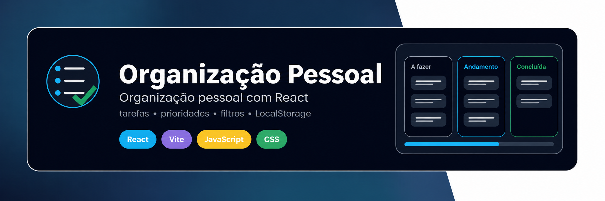
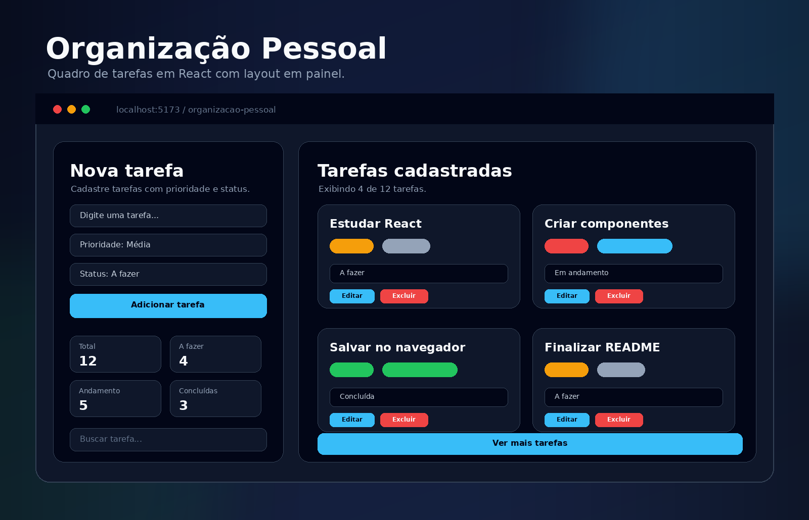

<p align="center">
  
</p>

# Organização Pessoal — Quadro de tarefas em React

## 📌 Sobre o projeto

**Organização Pessoal** é uma aplicação desenvolvida em **React** para gerenciamento de tarefas pessoais, com foco em organização, prioridade e acompanhamento de progresso.

O projeto foi criado como parte dos meus estudos em desenvolvimento front-end, com o objetivo de praticar conceitos fundamentais do React, como componentes, estado, props, eventos, renderização condicional, listas e persistência de dados no navegador.

---

## 🚀 Funcionalidades

* Cadastro de tarefas
* Definição de prioridade: baixa, média ou alta
* Definição de status: a fazer, em andamento ou concluída
* Listagem de tarefas em cards
* Edição do título da tarefa
* Exclusão individual de tarefas
* Limpeza completa da lista
* Filtro por status
* Busca por nome da tarefa
* Cards de resumo com estatísticas
* Persistência de dados com LocalStorage
* Layout em painel com entrada de dados e tarefas lado a lado
* Interface responsiva

---

## 🛠️ Stacks utilizadas

- React
- Vite
- JavaScript
- CSS3
- LocalStorage
- npm
- Git
- GitHub

## 📚 Conceitos praticados

Durante o desenvolvimento deste projeto, foram praticados os seguintes conceitos:

* Criação de projeto React com Vite
* Componentização
* Uso de `useState`
* Uso de `useEffect`
* Passagem de dados via props
* Manipulação de eventos
* Renderização de listas com `map`
* Remoção de itens com `filter`
* Atualização de objetos dentro de arrays
* Renderização condicional
* Persistência com LocalStorage
* Organização de arquivos em componentes
* Estilização com CSS puro
* Versionamento com Git

---

## 📂 Estrutura do projeto

```txt
react-task-board/
├── public/
├── src/
│   ├── components/
│   │   ├── Header.jsx
│   │   ├── TaskForm.jsx
│   │   ├── TaskList.jsx
│   │   ├── TaskCard.jsx
│   │   ├── FilterBar.jsx
│   │   └── SummaryCards.jsx
│   ├── utils/
│   │   └── taskLabels.js
│   ├── App.jsx
│   ├── main.jsx
│   └── index.css
├── assets/
│   └── readme/
├── package.json
└── README.md
```

---

## ▶️ Como executar o projeto

Clone o repositório:

```bash
git clone https://github.com/seu-usuario/react-task-board.git
```

Acesse a pasta do projeto:

```bash
cd react-task-board
```

Instale as dependências:

```bash
npm install
```

Execute o projeto:

```bash
npm run dev
```

Acesse no navegador:

```txt
http://localhost:5173
```

---

## 🖼️ Preview

<p align="center">
  
</p>
---

## 📈 Status do projeto

Projeto finalizado como parte da minha trilha de estudos em desenvolvimento web.

Este foi o terceiro projeto da sequência:

1. Python — Study Manager
2. JavaScript puro — Expense Tracker
3. React — Organização Pessoal
4. Node.js — próximo projeto

---

## 🧠 Aprendizados

Este projeto foi importante para consolidar a lógica de funcionamento do React na prática.

O foco principal foi entender como os dados fluem entre componentes, como o estado controla a interface e como funcionalidades comuns de aplicações reais podem ser construídas de forma simples e organizada.

---

## 🔮 Melhorias futuras

Algumas melhorias possíveis para versões futuras:

* Adicionar drag and drop entre colunas
* Criar categorias de tarefas
* Adicionar datas de prazo
* Criar modo claro e escuro
* Adicionar autenticação
* Integrar com backend em Node.js

---

